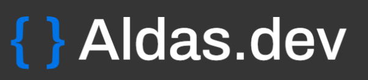

<div align="center">
    
</div>

# Aldas.dev Portfolio Website 🌐

Welcome to my portfolio website repository! This project showcases my skills, projects, and experiences in the field of web development.

## Project Highlights 🌟

- **Universal Design:** The portfolio website is designed to cater to a diverse audience, ensuring an inclusive and engaging user experience for everyone.

- **Responsive Accessibility:** The design is highly responsive, guaranteeing a seamless browsing experience across various devices and screen sizes.

- **Interactive Project Showcase:** Easily explore and learn about my projects through an interactive and visually appealing interface.


  🌐 **Live Demo:** [Here](https://aldas.vercel.app/)

## Built With 🛠️

- 
- 
- 


## Getting Started 🚀

Follow these steps to get started with the Portfolio website:

1. **Clone the repository:**

   ```sh
   git clone https://github.com/aldask/aldas-portfolio.git
   ```

2. **Install the necessary dependencies:**

   ```sh
   npm install
   ```

3. **Run the project locally:**

   ```sh
   npm start
   ```

4. **Start exploring the Aldas.dev website:**
   Open a web browser and navigate to `http://localhost:3000` to begin exploring the website.

Happy exploring!

## License 📜

This project is licensed under the [MIT License](https://opensource.org/licenses/MIT).

## Author 👤

Created by **Aldas Kasputis**

- 💻 [GitHub](https://github.com/aldask)
- 👨‍💼 [LinkedIn](https://www.linkedin.com/in/aldas-k-2ab99b1b4)
